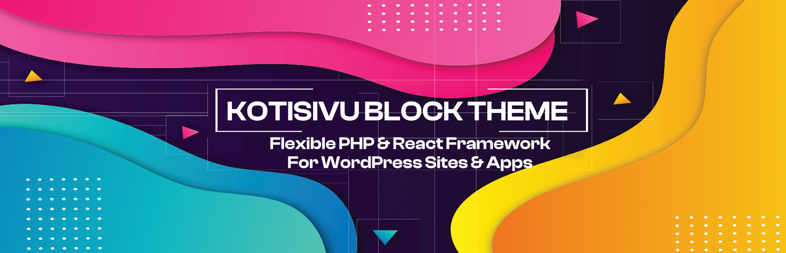

# Kotisivu Block Theme

  [](https://github.com/heikkivihersalo/kotisivu-block-theme/actions/workflows/lint-php.yml) [](https://github.com/heikkivihersalo/kotisivu-block-theme/actions/workflows/lint-js.yml) [](https://github.com/heikkivihersalo/kotisivu-block-theme/actions/workflows/lint-css.yml) [](https://github.com/heikkivihersalo/kotisivu-block-theme/actions/workflows/test-php.yml) 



> [!NOTE]
> Please do note that readme isn't necessarily up-to-date. This is due to that Kotisivu Block Theme is coming close to version 2 that comes with a lot updates related to structure, code quality, testing and linting.

Kotisivu Block Theme is a WordPress boilerplate theme that is designed to be as developer friendly while maintaining user-friendly interface for customers to maintain content. Main idea is to use WordPress purely as a CMS (Content Management System) and let the theme handle all styling and other things. Currently theme uses functions from both post and pre blocks era.

Originally theme was based on [Brad's Boilerplate](https://github.com/LearnWebCode/brads-boilerplate-wordpress/tree/main/brads-boilerplate-theme) theme but has seen a lot of changes since then so I'm not quite sure if there is anything left from that. Most latest update borrows some ideas from [Dude's Air Light](https://github.com/digitoimistodude/air-light) theme.

For most sites, theme offers everything you need including **Custom Post Types**, **Custom Fields**, **Custom Database Tables** and **Custom API Endpoints**. This effectively replaces the need for a plugins like _Advanced Custom Fields_ or _Custom Post Type UI_. Please do note that for customizability reasons, some features are only boilerplate code and might require some modifications to work properly in your context.

---

## Table of Contents

-   [Get Started](#get-started)
-   [Basic Structure](#basic-structure)
-   [CSS Styles](#css-styles)
-   [External Dependencies](#external-depencencies)
-   [Theme JSON](#theme-json)

    -   [Fonts](#fonts)
    -   [Colors](#colors)
    -   [Spacing](#spacing)
    -   [Core Block Styling](#core-block-styling)
    -   [Site and Content Width](#site-and-content-width)

-   [Templating System](#templating-system)
-   [Theme Config](#theme-config)

    -   [jQuery Loading](#jquery-loading)
    -   [Dark Mode](#dark-mode)
    -   [Theme Color](#theme-color)
    -   [Disable WordPress Default Configs](#disable-wordpress-default-configs)
    -   [Disable Admin Bar and Menu Junk](#disable-admin-bar-and-menu-junk)

-   [Custom Post Types](#custom-post-types)
-   [Custom Database Tables](#custom-database-tables)
-   [Custom API Endpoints](#custom-api-endpoints)
-   [Enqueuing scripts and styles](#enqueuing-scripts-and-styles)
-   [Security](#security)
-   [Admin Settings and Options](#admin-settings-and-options)

---

## Get Started

Except for few modifications, Kotisivu Block theme relies heavily on [WordPress](https://wordpress.org/) and [Gutenberg](https://wordpress.org/gutenberg/) core so you should be familiar with those.

To start developing or customizing for example new blocks, you can get started simply by running `yarn` command on your preferred editor. Then you can build files with `yarn build` or start development session `yarn start`. While developing your site, [Local](https://localwp.com/) works really well.

For basic sites, Kotisivu Theme does not require any plugins (except for forms because there is no point on developing own solutions for that).

Make sure that you have [Node.js](https://nodejs.org/en/) and [Yarn](https://yarnpkg.com/) installed on your computer to make any JS or CSS changes. PHP -files can be edited directly from `inc` folder.

Other thing to note is that `functions.php` file is meant to be kept as clean as possible. It only loads the main classes and site settings. All theme modifications, features and customizations should be done in separate files on `inc` -folder. Theme is organized to handle core modifications in `hooks` -folder and all features in `theme` -folder. There is also a `blocks` -folder that handles all block related classes and features.

### Get node_modules

```console
yarn
```

### Start development mode

```console
yarn start
```

### Build theme files

Build files are minified and optimized for production use. This approach works great but there is still some testing required if inline styles or one big CSS file is better for performance.

```console
yarn build
```

### Make translation files

For translation files [Poedit](https://poedit.net/) works really well. Just run `yarn make-pot` and open the .pot file with Poedit. Please do note that Poedit feature that creates translations from .pot file does not work properly (it doesn't recognize any files outside WordPress default logic for example if you have separate components folder for JSX components). You need to create the translations manually with `make-pot`. After that you can use Poedit to update the translations.

```console
yarn make-pot
```

After translations are done, remember to create json files with `yarn make-json` command. This is required for Gutenberg to load the translations.

```console
yarn make-json
```

### Create zip folder

To create a zip folder from theme, run `yarn zip` command. This is a quick way to create zip folder for theme updates. Zipped folder can be uploaded straight to WordPress.

```console
yarn zip
```

### Linting

Linting is enabled for PHP, JS and CSS. This is a great way to keep the code clean and consistent across the project. Linting is done with ESLint, Stylelint and PHP Code Sniffer. PHP uses WordPress coding standards with few modifications to prevent it from being too strict.

#### Lint JS files

```console
yarn lint:js
```

#### Lint CSS files

```console
yarn lint:css
```

#### Lint PHP files

```console
composer lint:php
```

### General tips

While developing different iterations of this theme (and native Gutenberg block building in general), I have found out several workflows that work really well. Here are some of them:

1. Block variations and templates work really well together. For example, a lot the times markup can be created just with core blocks and by applying desired styling to them. Take a look at the `hero` block for an example how this can be done.

2. Think block style as a utility class. Sometimes there can be situations where you need to do something just a little bit different. There is no need to create new inspector controls for this. Just create a new block style and use it when needed.

3. Taking away all the control is probably not the best idea. Ideology behind `section` and `wrapper` is to limit possibilities that client has. Also it creates a little bit cleaner markup. However there is a custom built styling options (css grid, background color and spacing). These are probably one of the most common controls that are needed for different sections, so it is wise to have the ability to control them straight from the editor.

4. Creating separate set of utility classes is also probably a good thing. In `src/assets/styles/inline/utilities.css` you can find current utility classes that are added to the site <head>. Really useful ones are basically all the css-grid related stuff (`cols-<XX>`) and `is-visually-hidden` that hides the element visually but keeps it accessible for screen readers.

5. Dynamic blocks are great for site headers, footers, dynamic data or React apps. Usually client does not need that much of an control to modify header or footer information so you can just build it with PHP. Content can be fetched from options or menus. You can also create a block template to give little bit of control. Dynamic blocks work great for blog post templates (or similar). It is so much easier to create markup with PHP than with FSE (Full Site Editor).

6. For more complex stuff, you can use `view.js` files to build anything from an simple block to entire react app. Just remember that Poedit doesn't understand anything outside of WordPress default logic so you need to create the translations manually with `make-pot`.

---

## Basic Structure

```javascript
├── .vscode // VSCode spesific config files for a faster workflow
├── build // Build files created from src folder
├── inc
│   ├── blocks // Any block related classes goes here
│   ├── hooks // WordPress core modifications goes here
│   ├── lib // External dependencies that doesn't support composer goes here. DO NOT add your own customizations in this folder. Use a wrapper instead to modify library behaviour.
│   ├── theme // Any theme related features goes here (post types, options etc.)
│   │   ├── ...
│   ├── blocks.php // Handle block related modifications and hooks
│   ├── hooks.php // Handle WordPress core modifications and hooks
│   ├── theme.php // Handle theme features and settings
│   ├── utils.php // Utility functions that are used across the theme
├── languages // WordPress main folder for translations
├── public // Other theme assets that are loaded on front-end and back-end (fonts and icons etc.)
│   ├── fonts // Theme fonts. NOTE! Remember to add correct paths to theme.json
│   │   ├── ...
│   ├── icons // Theme icons. It is advisable to folder the icons accordingly
│   │   ├── ...
│   ├── lib // Pure JS libraries that are not required to be built (Splide for example)
├── src // JS and CSS files that requires a build process (Blocks, theme CSS and JS)
│   ├── assets // Theme related JS and CSS
│   │   ├── scripts // Theme scripts
│   │   │   ├── ...
│   │   ├── styles // Theme styles
│   │   │   ├── ...
│   ├── block-library
│   │   ├── core // Core block modifications
│   │   │   ├── ...
│   │   ├── custom // Custom Gutenberg blocks
│   │   │   ├── ...
│   │   ├── parts // Theme parts like header, footer and navigation
│   │   │   ├── ...
│   ├── components // Custom built components for reusability purposes
│   │   ├── ...
│   ├── hooks // Custom built hooks for reusability purposes
│   │   ├── ...
│   ├── icons // Global icons that are used across the blocks
│   │   ├── ...
│   ├── page-templates // Page template that are used to hydrate WordPress templates
│   │   ├── ...
│   ├── stores // Boilerplate for WordPress Redux stores
│   │   ├── ...
│   ├── utils // Utility functions
│   │   ├── ...
├── templates // Block theme style templates folder
├── .editorconfig
├── .eslintignore
├── .eslintrc.json
├── .gitignore
├── .prettierignore
├── .prettierrc.js
├── .stylelintrc.json
├── bootstrap.php
├── composer.json
├── composer.lock
├── functions.php // WordPress functions PHP. Mainly just loading the main classes (Theme and Blocks). Meant to kept as clean as possible and probably don't require any modifications
├── jsconfig.json // Config for build and development processes
├── package.json
├── style.css // Required by WordPress. Don't add any styles in here
├── theme.json // Block theme core config file
├── webpack.config.js // Default config file for file building
```

---

## CSS Styles

Blocks uses BEM naming convention for css classes. For more information read [https://getbem.com/introduction/](https://getbem.com/introduction/).

## External Depencencies

Because some things in WordPress are little bit difficult to work with, theme uses a few external libraries to make things more pleasant. Please do note that dependencies are meant to stay separate from rest of the theme (for update reasons). Meaning that if you need to do modifications, use a wrapper instead.

### PostTypes [[Github](https://github.com/jjgrainger/PostTypes)]

Post Types is a simple library to add custom post types to a WordPress theme.

### RationalOptionPages [[Github](https://github.com/jeremyHixon/RationalOptionPages)]

Option pages are a pain to work with and RationalOptionPages makes it little bit easier.

### Other recommendations

These are not installed by default but are recommended to use in more complex projects.

#### Tanstack Query [[Link](https://tanstack.com/query/latest)]

Can be used to build performant and complex queries for data fetching.

#### React Router [[Link](https://reactrouter.com/en/main)]

Can be used to handle URL parameters in React apps.

---

## Theme JSON

Theme.json is used by block theme as a primary theme config file.

### Fonts

#### Font Family

Font families are configured as a array. Add as many fonts as you like. For different font styles, new family is not necessary. Add new fontFace instead. For every new font family, WordPress adds an CSS variable. Format is always "--wp--preset--font-family--<FONT_SLUG>"

```json
      "fontFamilies": [
        {
          "fontFamily": "\"<FONT_NAME>\"", // For example "Roboto"
          "name": "<FONT_NAME>", // For example "Roboto"
          "slug": "heading", // Use whatever you want. Default has been "heading" and "body"
          "fontFace": [
            {
              "fontFamily": "<FONT_NAME>", // For example "Roboto"
              "fontWeight": "<FONT_WEIGHT>", // For example 700
              "fontStyle": "normal",
              "fontStretch": "normal",
              "src": ["file:./public/fonts/<FOLDER>/<FILE>.woff2"]
            }
          ],
          ...
        },
        ...
        ]
```

#### Font Size

Font sizes uses WordPress default scheme (--wp--preset--font-size--<FONT_SIZE>). You can configure own preset if you like but default values are:

| Size | Variable                          |
| ---- | --------------------------------- |
| H1   | --wp--preset--font-size--colossal |
| H2   | --wp--preset--font-size--gigantic |
| H3   | --wp--preset--font-size--huge     |
| H4   | --wp--preset--font-size--large    |
| H5   | --wp--preset--font-size--medium   |
| H6   | --wp--preset--font-size--medium   |

There are also own variables for `small` and `tiny` sizes.

Margins and line-heights can be adjusted on elements -section.

> [!NOTE]
> NOTE: WordPress currently has a bug on fluid typography. Use clamp instead.

### Colors

Colors are defined using default WordPress scheme that adds new CSS variable for every color that is added. Format is always "--wp--preset--color--<COLOR_SLUG>".

#### Dark Mode

If dark mode is enabled for site, some values are overriden by separate file. If you need to change these values you can do it from theme.json and by editing custom variable values (--wp--custom--color--dark-mode--<COLOR_SLUG>)

```json
"custom": {
  ...
  "color": {
    "darkMode": {
      "colorBlack": "some hsl values",
      ...
    },
    ...
  }
  ...
}
```

#### Link Colors

Link colors can be adjusted on elements -section. Defaults works really well and usually does not need any adjustments.

### Spacing

Spacing uses default WordPress formatting (--wp--preset--spacing--<SPACING_SLUG>) and is calculated with clamp. Values work pretty well across different sites and doesn't usually require any modifications. There are times where spacing needs to be something different so easiest is to use CSS calc() -function in these situations.

```json
"spacing": {
  "units": ["em", "rem", "%", "vw", "vh"],
  "blockGap": null,
  "margin": true,
  "padding": true,
  "spacingSizes": [
    ...
    {
      "size": "clamp(0.618046971569839rem, calc(0.615109684219015rem + 0.0146864367541203vw), 0.63273340832396rem)",
      "slug": "20",
      "name": "1"
    },
    {
      "size": "clamp(1rem, calc(0.975rem + 0.125vw), 1.125rem)",
      "slug": "30",
      "name": "2"
    },
    ...
  ]
}
```

### Core Block Styling

Basically almost every styling option is disabled for site editor. Font size, font families, margins and paddings can be modified from the editor.

### Site and Content Width

For element and content width, theme uses custom variables.

| Variable                   | Description                                                                             |
| -------------------------- | --------------------------------------------------------------------------------------- |
| --wp--custom--narrow-size  | Narrow size, max-width 80ch by default                                                  |
| --wp--custom--content-size | Default content size for page. Usually good value is somewhere between 1000px - 1400px. |
| --wp--custom--wide-size    | Max width for page. Default is based on desktop screen size (1920px).                   |

To center element to the page with proper margins, setting `margin-inline: auto` works really well

```css
.element {
	width: var(--wp--custom--content-size);
	margin-inline: auto;
}
```

---

## Templating System

To provide more flexible developer experience, theme bypasses block theme default templating system. Instead, it uses dynamic blocks to create different parts of the site. Template structure is handled by first creating a normal HTML template in `templates` folder.

For example typical block theme index.html file looks like this:

```html
<!-- wp:ksd/part-header /-->
<!-- wp:ksd/template-main { "templateSlug": "template-index", "className": "" } /-->
<!-- wp:ksd/part-footer /-->
```

Block `template-main` is a wrapper for the main content and can be used to also add global styling. `templateSlug` -key is used to fetch the correct template from `templates` folder. `className` -key is used to add custom classes to the template.

Take a look at `templates` and `src/page-templates` folders, and you can notice that the file/folder names pretty much match each other.

> [!NOTE]
> Everything block related are handled in `Blocks` -class. However page templates are excluded from user controlled blocks so they cannot be insereted from the editor.

Templates are then modified with PHP and React. These are stored in `src/page-templates` folder and are part of the regular build process.

To user this doesn't make such big of an difference but creating new templates and parts with PHP and React is much more flexible than trying to do everything with FSE (Full Site Editor).

> [!NOTE]
> If it is required for user to edit template parts, you must create a page template completely with FSE.

`do_blocks` -function is excelent for rendering individual blocks or parts in templates. This can be anything from dark-mode-toggle to social icons etc.

Example usage:

```php
  echo do_blocks('<!-- wp:<BLOCK_NAMESPACE>/<BLOCK_SLUG> {"attribute_key":"attribute_val"} /-->');
```

---

## Theme Config

Basic configurations can be done from the `functions.php` -file.

### jQuery Loading

You can switch between loading jQuery normally, on footer or not loading at all. Please do note that if you are using any plugins that require jQuery, you might need to load it normally. WordPress admin requires jQuery so it cannot be disabled completely.

### Dark Mode

Enabling dark mode loads necessary assets to use dark mode. You need to have a toggle with class `.dark-mode-toggle` to switch between light and dark mode. Theme has own block for simple toggle that can be used.

### Theme Color

Theme color is user for example to color the browser bar on mobile devices.

If enabled it adds following meta tags to the site head:

```html
<meta name="theme-color" content="<THEME_COLOR>" />
<meta name="msapplication-navbutton-color" content="<THEME_COLOR>" />
<meta name="apple-mobile-web-app-status-bar-style" content="<THEME_COLOR>" />
```

To modify the color change state to active and add color value to `color` -key.

```php
...
  "themeColor" => [
    "active" => true,
    "color" => "hsl(343, 100%, 48%)"
  ],
...
```

### Disable WordPress Default Configs

You can disable some of the wordpress default stuff from loading. These are not usually required but if you are having problems, you can try disabling these.
| Config Option | Description |
| --------------------- | ----------- |
| "canonical" | Remove canonical link. `Default: true` |
| "duotone" | Remove duotone. Only removes SVG's. Variables are still added. Might become obsolete in the future. `Default: true` |
| "emojis" | Disable WordPress emojis. `Default: true` |
| "feed-links" | Remove feed links. `Default: true` |
| "gravatar" | Disable Gravatar. `Default: false` |
| "jquery-migrate" | Remove jQuery migrate scripts from loading. If you are using really old legacy plugins, jquery-migrate might be needed. `Default: true` |
| "json-api" | Disable JSON API and remove link from header. `Default: true` |
| "next-prev-links" | Remove the next and previous post links. `Default: true` |
| "rsd" | Remove Really Simple Discovery link. `Default: true` |
| "shortlink" | Remove shortlink url from header |
| "woocommerce-version" | Remove WooCommerce version number showing up on frontend. `Default: true` |
| "wp-version" | Remove WordPress version number showing up on frontend. `Default: true` |
| "xlmrpc" | Disable XML-RPC methods that require authentication. `Default: true` |
| "block-library" | Disable Gutenberg block library styles. `Default: true` |
| "fluent-forms" | Disable Fluent Form plugins styles. `Default: true` |
| "global-styles" | Disable global styles (theme.json). `Default: false` |

### Disable Admin Bar and Menu Junk

You can disable admin bar and menu junk from loading. This is useful if you want to keep the admin area clean.

TODO: Add options and examples

### Site Menus

You can set site menus that are registered to the site from here. Please do note that if you do any changes, you need to update blocks that use these menus.

```php
...
"menus" => [
  [
    "slug" => "header-nav",
    "name" => __("Header Navigation", "kotisivu-block-theme")
  ],
  [
    "slug" => "legal-nav",
    "name" => __("Legal Navigation", "kotisivu-block-theme")
  ],
  [
    "slug" => "footer-nav",
    "name" => __("Footer Navigation", "kotisivu-block-theme")
  ]
],
...
```

### Image Sizes

WordPress default image sizes are customized a little bit to better support variety of devices.

| Name         | Slug         | Width  | Height | Type    |
| ------------ | ------------ | ------ | ------ | ------- |
| Retina       | retina       | 2880px | 1800px | Custom  |
| Huge         | huge         | 1920px | 1440px | Custom  |
| Large        | large_size   | 1600px | 1200px | Default |
| Medium Large | medium_large | 1366px | 1025px | Custom  |
| Medium       | medium_size  | 1024px | 768px  | Default |
| Small        | small        | 768px  | 576px  | Custom  |
| Extra Small  | extra_small  | 640px  | 480px  | Custom  |

---

## Custom Post Types

TODO: Update this section with new PHP model

```php

```

### Slug Translations

TODO: Add instructions slug translations

### Metaboxes

TODO: Update this section with new PHP model

Metaboxes are a custom built wrapper to extend functionalities of PostType library. For simple purposes it is meant to replace plugins like Advanced Custom Fields (and in my opinion it is way cleaner and better alternative). However, for more complex use cases it might be smart to use separate plugin to handle custom fields. Currently supported fields are: `checkbox-group`, `checkbox`, `date`, `image`, `number`, `radio-group`, `rich-text`, `select`, `text`, `textarea`, `url`.

```php

```

---

## Custom Database Tables

Adding custom database tables can be done by enabling the feature and deactivating and activating the theme. This will run `after_switch_theme` -hook and create the tables with the schema provided.

TODO: Add documentation

> [!WARNING]
> This feature is still in very barebone state. Test it thoroughly before using it in production.

```php

```

---

## Custom API Endpoints

Custom API endpoints are a great way to provide customized logic to front-end and to keep queries clean.

TODO: Add documentation

---

## Enqueuing scripts and styles

TODO: Add documentation

---

## Security

For security reasons, theme has a few things that are disabled by default.

1. Rest API is only visible for logged in users
2. Author pages are disabled and redirected to front page

There can be more things that are disabled in the future.

---

## Admin Settings and Options

Theme settings can be found on admin panel.

### Analytics

Theme uses custom Tag Manager script that sets a delay for loading the container. Ideology is to load analytics after everything else, so any analytics script that is added, does not slow down the page. Default delay 2 seconds works really well and does not usually require any changes.

> [!NOTE]
> Tag Manager is recommended way to add any analytics related scripts including CMP (Cookie Management Platform).

### Contact and Social Platform Information

Theme has a centralized place to add company's social platform and contact information. These can be dynamically fetched from database so you don't have to pass same information again and again. For example default footer and social icon blocks use dynamic data.
